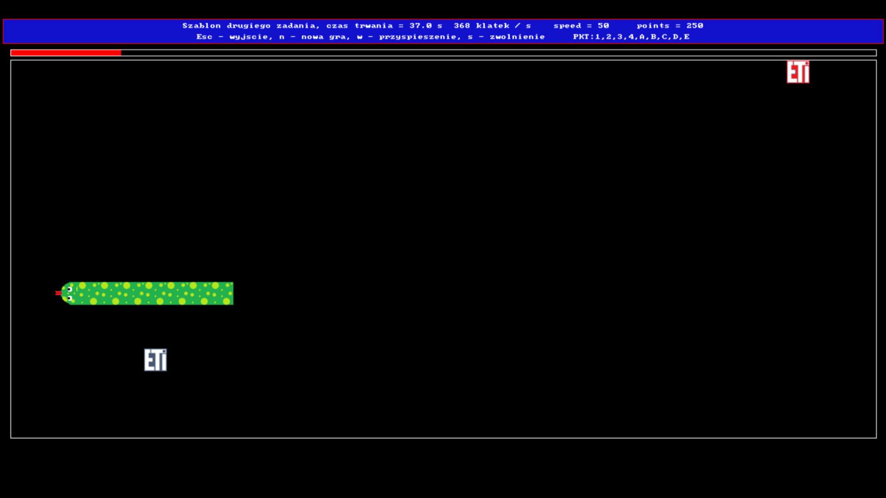
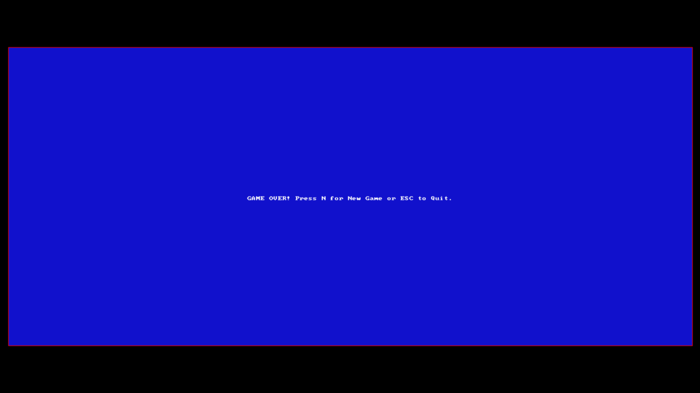

# Snake Game (SDL2, C++)

A classic Snake game implemented in C++ using the SDL2 library. This project features smooth graphics, keyboard controls, game state saving/loading, and bonus mechanics, all designed for an engaging retro gaming experience.

---

## Table of Contents

- [Project Overview](#project-overview)
- [Key Features](#key-features)
- [Getting Started](#getting-started)
  - [Prerequisites](#prerequisites)
  - [Installation](#installation)
  - [Running the Game](#running-the-game)
- [Usage](#usage)
- [Support & Documentation](#support--documentation)
- [Contributing](#contributing)
- [Maintainers](#maintainers)

---

## Screenshots

---

## Project Overview

**Snake Game (SDL2, C++)** is a modern take on the classic Snake arcade game, built for desktop platforms. The game leverages the SDL2 library for graphics and input, providing a responsive and visually appealing gameplay experience. Players control a snake, collect dots to grow, and avoid collisions with the walls and themselves. Special red dots and a progress bar introduce bonus mechanics for added challenge.

---

## Key Features

- **Classic Snake Gameplay**: Grow your snake by collecting dots, avoid self-collision and borders.
- **Bonus Mechanics**: Special red dots appear with time-limited bonuses (speed boost, tail shortening).
- **Progress Bar**: Visual timer for bonus dot availability.
- **Game State Saving/Loading**: Save your progress and resume later.
- **Customizable Graphics**: Easily swap out bitmap files for different snake and dot appearances.
- **Keyboard Controls**: Intuitive arrow key navigation and hotkeys for game actions.
- **Performance Metrics**: Real-time FPS and elapsed time display.

---

## Getting Started

### Prerequisites

- **C++14** compatible compiler (e.g., MSVC, GCC, Clang)
- **SDL2** development libraries (version 2.0.10 or compatible)
- **CMake** or Visual Studio 2022 (recommended for Windows)
- **Git** (for cloning the repository)

### Installation

1. **Clone the repository:**

2. **Install SDL2:**
   - Download SDL2 development libraries from [SDL2 Downloads](https://www.libsdl.org/download-2.0.php)
   - Place the `SDL2-2.0.10` folder in the project root (as referenced in `main.cpp`), or adjust include paths as needed.

3. **Build the project:**
   - **With Visual Studio 2022:**
     - Open the solution or create a new project, add `main.cpp`.
     - Ensure SDL2 include and lib directories are set in project properties.
     - Build and run.
   - **With CMake (cross-platform):**
     - (CMakeLists.txt not provided by default; create one if needed.)

4. **Prepare bitmap assets:**
   - Place required BMP files in a `bmpFiles` directory:
     - `cs8x8.bmp`, `eti.bmp`, `etic.bmp`, `headUp.bmp`, `headDown.bmp`, `headLeft.bmp`, `headRight.bmp`, `body.bmp`
   - These are referenced in the code and must be present for the game to run.

### Running the Game

- **From Visual Studio:** Press `F5` or select "Start Debugging".
- **From command line:** Run the compiled executable from the project directory.

---

## Usage

**Controls:**

- `Arrow Keys` — Move the snake (no reverse direction allowed)
- `N` — Start a new game
- `S` — Save game state
- `L` — Load game state
- `ESC` — Quit the game

**Gameplay:**

- Collect regular dots to grow and score points.
- Special red dots appear periodically; collect them before the progress bar runs out for bonuses.
- Avoid colliding with the snake's own body or the game borders.

---

## Support & Documentation

- For issues, bug reports, or feature requests, please use the [Issues](issues) section.
- For license information, see [LICENSE](LICENSE).

---

## Maintainers

- **Konrad Machura**  
  Main developer and maintainer

For questions or support, open an issue or contact the maintainer via GitHub.

---

*Enjoy the game and happy coding!*
